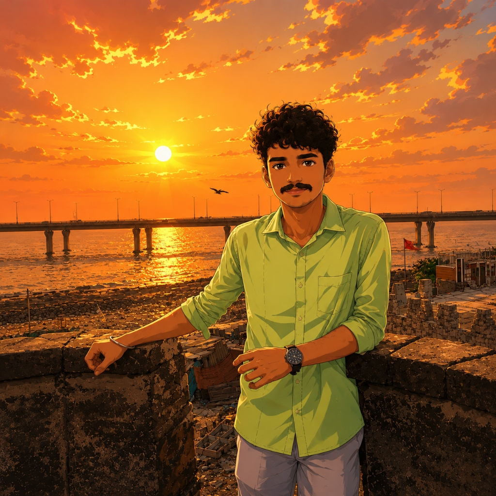

# Yash Vilas Mejari (ShivKG) — Personal Portfolio Website 🚀



A high-end, responsive, single-page presentation portfolio built for **Yash Vilas Mejari** (brand: **ShivKG**) — Computer Science Undergraduate and Aspiring Software Developer. 

Inspired by modern creative developer portfolios, featuring a dark Mumbai-night color scheme (`#050811`), cool cyan (`#00e5ff`) & warm magenta (`#ff2a85`) accents, a CS journey timeline, interactive AI project deep-dives, and smooth horizontal slide presentation transitions.

---

## ✨ Key Features

- 🌌 **Mumbai Rainy Night Aesthetic**: Dark navy sky background (`#050811`), cool cyan-blue streetlight reflections (`#00e5ff`), and warm magenta neon accents (`#ff2a85`).
- 🎛️ **Presentation Slide Deck**: Smooth horizontal slide transitions with interactive bottom pagination dots, chevron controls, mouse wheel, keyboard arrow keys, and touch swiping.
- 🎯 **CS Journey Timeline**: Connected vertical timeline detailing B.Tech CS degree, daily DSA practice on **Striver's A2Z Sheet** using Python, and **GATE 2027** preparation.
- 💻 **Interactive AI Project Modals**: Deep-dive showcases for **AI Code Error Debugger** and **MultiMind AI** with architecture highlights, feature breakdowns, and Python implementation code snippets.
- 📬 **Click-to-Copy Email & Contact Simulator**: 1-click email copy helper (`yashmejari7@gmail.com`) and instant message simulator.
- 📱 **Mobile-First Responsiveness**: Supports `100dvh` (Dynamic Viewport Height) for mobile Chrome/Safari with zero text overlap or clipping.

---

## 📁 Section Structure

1. **Slide 01 — Home (Hero)**: Headline, role, tagline, CTAs, social icons, and portrait visual.
2. **Slide 02 — About**: Bio story, Striver's A2Z DSA focus, GATE 2027 prep, and CS timeline.
3. **Slide 03 — Skills**: Filterable technical toolkit (Languages, Core CS, Tools, Currently Learning).
4. **Slide 04 — Projects**: Featured AI projects with interactive architecture modals.
5. **Slide 05 — Contact**: Email copy helper, direct message form, and footer credentials.

---

## 🛠️ Tech Stack

- **Framework**: React 19, Vite
- **Styling**: Tailwind CSS v4, Custom CSS Tokens
- **Icons**: Lucide React + Custom SVG Icons
- **Fonts**: Google Fonts (`Plus Jakarta Sans` & `Fira Code`)

---

## 🚀 Quick Start (Local Development)

```bash
# 1. Install dependencies
npm install

# 2. Run local dev server
npm run dev
```

Open `http://localhost:5173/` in your browser.

---

## 📦 Production Build & Deployment

```bash
# Build production bundle
npm run build

# Preview build locally
npm run preview
```

The output bundle is generated inside `dist/` and ready to deploy on **Vercel**, **Netlify**, or **GitHub Pages**.

---

## 👤 Author

- **Name**: Yash Vilas Mejari
- **Brand / Handle**: ShivKG
- **Role**: CS Undergraduate | Aspiring Software Developer
- **Email**: [yashmejari7@gmail.com](mailto:yashmejari7@gmail.com)
- **LinkedIn**: [Yash Mejari](https://www.linkedin.com/in/yash-mejari-396600334/)
- **GitHub**: [@Y5213](https://github.com/Y5213)
